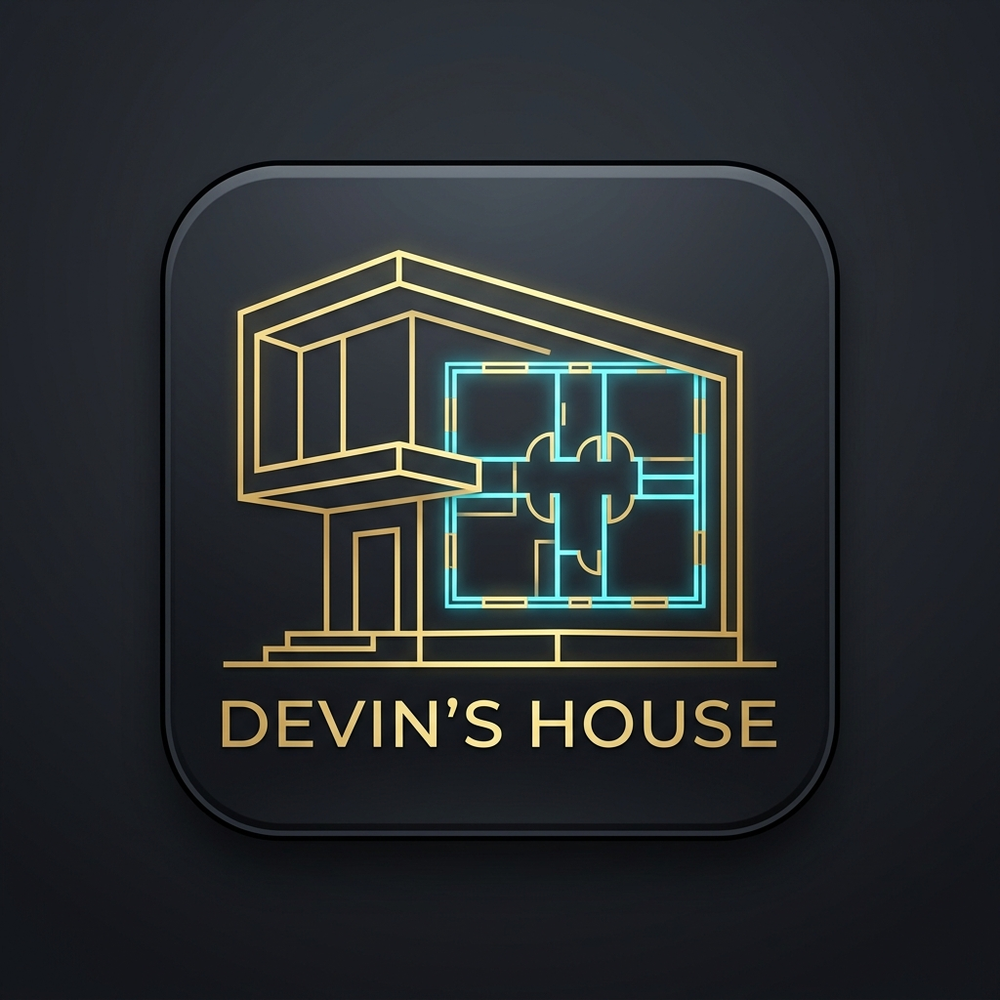

# Devin's House - Architectural & Construction Management PWA

An offline-ready Progressive Web Application (PWA) and architectural design portfolio for an exact **8.00m × 5.00m (40.0 m²)** modern residential home featuring a **Kangaroo-style hidden roof**.



---

## 🌟 Key Features

1. **Exact 8.00m × 5.00m Rectangular Footprint**:
   - Optimized 40.00 m² ground base.
   - Kangaroo-style hidden parapet roof concealing the sloping metal roof behind modern exterior parapet walls with internal box gutters.
2. **Master Bedroom on Top of Kitchen**:
   - Built on the only intermediate floor slab in the house.
   - Includes an integrated wooden wardrobe and a dedicated changing nook with full-length mirror and changing bench.
3. **Full-Span Lower Kitchen**:
   - Dry pantry kitchen spanning the entire width underneath the master bedroom slab.
   - Full-width pantry cabinetry, deep soft-close drawers, and a dining bar island with 4 stools (strictly no sink and no fridge).
4. **Untouched Stairs Along Wall**:
   - Straight open-riser timber staircase running along the side wall leading smoothly to the master bedroom.
5. **Kids Bedroom**:
   - Ground-floor room enclosed with an interior timber door.
   - Contains strictly a solid timber double-decker bunk bed and wooden wardrobe only (no desks, zero clutter).
6. **Seating Room Suite**:
   - Under soaring double-height cathedral ceiling with exposed rafters.
   - Furnished with a 3-seater sofa, two 1-seater armchairs, rectangular oak coffee table, and TV stand console.
7. **Single 3.5-Foot Solid Metal Entrance Door**:
   - Sturdy fluted dark steel security door (not glass).
   - Strictly the only exterior door to the house.
8. **Option 6: Smart Zero-Slab Mezzanine (Metal & Timber on 4 Masonry Pillars)**:
   - Eliminates the suspended concrete slab to save over $3,200 in construction costs and 4 weeks of curing downtime.
   - Supported by 4 solid non-metallic white-plastered masonry pillars carrying horizontal steel I-beams and timber joists (20 m² master suite).
   - Under-staircase built-in TV entertainment console and oak bookshelves freeing the entire double-height living room.
   - Private enclosed kids bedroom with solid partition walls, wooden door, custom integrated cabin beds with step drawers, and wardrobe.
   - Kangaroo-style hidden parapet roof concealing low-pitch metal roof and internal box gutters.
   - Complete seating suite (3-seater sofa + three 1-seater armchairs + coffee table), black metallic security front door, and metallic-frame glass windows.

---

## 📱 Progressive Web App (PWA) Features

- **Installable Desktop/Mobile App**: Install directly from Chrome, Edge, or mobile browsers with desktop/home screen icon (`manifest.json`, `app_icon.jpg`).
- **100% Offline Ready**: Pre-cached by custom service worker (`sw.js`).
- **Live Editable Measurements**: Real-time room dimension adjustments with dynamic floor area recalculations.
- **Construction Expense Tracker**: Manage project budget, log expenditures by category, and export to CSV.
- **Engineering Calculators**: Paint & primer takeoffs, oak parquet flooring, electrical rough-in, and plumbing/box-gutter estimates.
- **Construction Progress Tracker**: 10-milestone checklist from ground excavation to final handover.
- **Cost Minimization Guide**: Over $10,800 in structural savings documented.
- **Download Hub**: Download individual 3D renders, vector CAD SVGs, or export the full construction pack to PDF.

---

## 🛠️ Tech Stack

- **Core**: Semantic HTML5 & Vanilla Modern JavaScript (`app.js`)
- **Styling**: Modular Vanilla CSS (`styles.css`) with zero inline styles and full cross-browser compatibility
- **PWA**: Web App Manifest (`manifest.json`) and Cache-First Service Worker (`sw.js`)
- **Visuals**: High-resolution 3D cutaways and exterior facade renders (Octane / Unreal Engine 5 render style)

---

## 🚀 Running Locally

Open `index.html` in any modern web browser or serve via any static HTTP server:

```bash
# Using Python
python -m http.server 8080

# Using Node.js
npx serve .
```

---

## 📄 License

Created for Devin's House project. All rights reserved.
